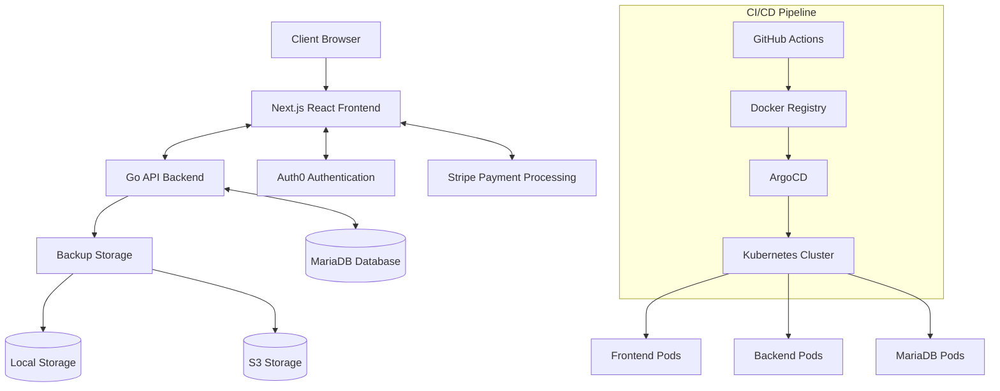

# React Frontend Integration Plan for GoSQLGuard

This document outlines the plan for integrating a modern React frontend with GoSQLGuard's existing Go backend.

## Project Overview

GoSQLGuard currently uses a server-side rendered HTML interface. This plan will transform it into a modern architecture with:

- React/Next.js frontend for an improved user experience
- Go backend providing RESTful API endpoints
- MariaDB for database storage
- Auth0 for authentication
- Stripe for payment processing (for premium features)
- Kubernetes, Helm, and ArgoCD for deployment

## Architectural Design

## Implementation Strategy

The implementation will follow these major phases:

1. **Proof of Concept (POC)**: Validate the approach with a minimal implementation
2. **Core Backend Transformation**: Convert HTML endpoints to JSON API endpoints
3. **Frontend Development**: Build the React/Next.js application
4. **Database Migration**: Move from file-based metadata to MariaDB
5. **Auth & Payment Integration**: Implement Auth0 and Stripe
6. **Deployment Setup**: Configure Kubernetes, Helm, and ArgoCD
7. **Testing & Launch**: Final testing and production deployment

## Technology Stack

### Frontend
- **Framework**: React with Next.js
- **Language**: TypeScript
- **State Management**: React Query/SWR for data fetching
- **UI Components**: Custom components with Tailwind CSS
- **Authentication**: Auth0 React SDK
- **Payment Processing**: Stripe React components

### Backend
- **Language**: Go
- **API**: RESTful JSON API
- **Database Access**: GORM for MariaDB
- **Authentication**: Auth0 JWT validation
- **Payment Processing**: Stripe Go SDK

### Database
- **MariaDB**: For application data and backup metadata

### DevOps
- **Containerization**: Docker
- **Orchestration**: Kubernetes
- **Package Management**: Helm
- **Continuous Deployment**: ArgoCD
- **CI/CD**: GitHub Actions

## Proof of Concept Plan

Before full implementation, a Proof of Concept will be created to validate the approach.

### POC Scope
- Setup Next.js frontend with TypeScript
- Implement Auth0 authentication
- Create a dashboard that displays backup status
- Convert key API endpoints to JSON format
- Demonstrate working data flow between frontend and backend

### POC Timeline
- **Phase 1 (Setup)**: 1-2 weeks
- **Phase 2 (Implementation)**: 2-3 weeks
- **Phase 3 (Integration)**: 1-2 weeks
- **Total**: 4-6 weeks

## Full Implementation Timeline

- **Foundation Phase**: 4 weeks
- **Core Features Phase**: 6 weeks
- **Advanced Features Phase**: 6 weeks
- **DevOps & Deployment Phase**: 4 weeks
- **Optimization & Launch Phase**: 4 weeks
- **Total**: 24 weeks (6 months)

## Subscription Model

Based on the Nexmonyx framework model:

1. **Free Tier**
   - Limited to 3 database servers
   - Basic backup types (daily only)
   - Email alerts only
   - 7-day backup retention
   - Community support

2. **Professional Tier**
   - Up to 10 database servers
   - Multiple backup types (hourly, daily, weekly)
   - Multiple alert channels
   - 30-day backup retention
   - Email support

3. **Enterprise Tier**
   - Unlimited database servers
   - Custom backup schedules
   - Advanced retention policies
   - All notification channels
   - Priority support
   - Team management
