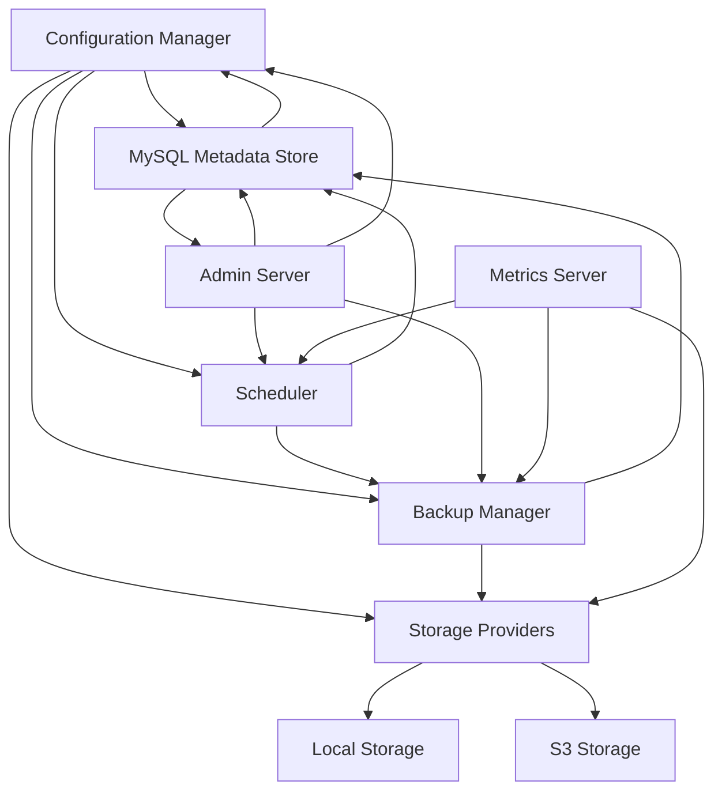

# System Patterns in GoSQLGuard

## System Architecture

GoSQLGuard follows a modular architecture with clearly defined components that work together to provide a complete MySQL backup solution. The architecture is designed for extensibility and maintainability.

### Core Components

1. **Configuration Manager**
   - Loads basic configuration from environment variables only
   - Connects to MySQL metadata database for dynamic configuration
   - Loads server definitions, schedules, and options from database
   - Supports dynamic reloading without restart
   - No longer uses YAML configuration files

2. **Scheduler**
   - Manages scheduled backup jobs using cron expressions from database
   - Dynamically reloads schedules when changed in database
   - Handles job queuing and execution
   - Maintains schedule state across restarts
   - Fixed hourly schedules to run at top of hour (0 * * * *)

3. **Backup Manager**
   - Coordinates the backup process
   - Executes MySQL dumps with appropriate flags
   - Manages backup compression
   - Routes backups to appropriate storage providers

4. **Storage Providers**
   - Abstract interface for storage operations
   - Implementations for local filesystem and S3-compatible storage
   - Manage retention policies for their respective storage types

5. **Metadata Store**
   - Maintains records of all backup operations in MySQL database
   - Stores configuration data (servers, schedules, options)
   - Tracks backup status, size, location, and other metadata
   - Supports querying and filtering of backup records
   - Provides repository pattern for data access
   - Enables dynamic configuration management

6. **Admin Server**
   - Provides web-based interface for monitoring and management
   - Exposes API endpoints for backup operations
   - Renders status dashboards and backup history
   - Enables configuration editing through UI (schedules, options)
   - Real-time configuration updates without restart

7. **Metrics Server**
   - Exposes Prometheus-compatible metrics
   - Tracks key performance indicators
   - Supports alerting based on backup status

## Docker Runtime
- Base image: Ubuntu 22.04 (for better MySQL 8.0 compatibility)
- Multi-stage build with Go compilation in first stage
- Minimum required packages installed:
  - mysql-client-core-8.0 (for native MySQL 8.0+ authentication support)
  - postgresql-client
  - ca-certificates
  - tzdata
  - openssl
- Set DEBIAN_FRONTEND=noninteractive to prevent interactive prompts during build
- Static binary copied from builder stage
- Minimal runtime footprint

## Key Technical Decisions

### Golang as Implementation Language
- Strong concurrency support for handling multiple backup operations
- Compiled language with minimal runtime requirements
- Cross-platform compatibility
- Excellent standard library support for HTTP, JSON, and filesystem operations

### Goroutines and Channels for Concurrency
- Scheduler runs in a dedicated goroutine
- Backup operations run in their own goroutines
- Channels used for communicating between components
- Context objects for graceful cancellation

### Interface-Based Design
- Storage providers implement common interfaces
- Enables easy addition of new storage types
- Facilitates testing with mock implementations

### In-Memory Data with Persistence
- Metadata maintained in memory for performance
- Regular persistence to disk for durability
- Recovery from persistent store on startup

### Reactive UI Architecture
- Web UI renders data from server state
- UI updates via API polling
- No client-side state management for simplicity

## Component Relationships

### Configuration Flow
- Basic config is loaded at startup from environment variables
- Dynamic configuration is loaded from MySQL metadata database
- Components can reload configuration on-demand
- Dynamic reconfiguration is fully supported without restart
- UI changes to configuration take effect immediately

### Backup Process Flow

### Retention Policy Enforcement

## Error Handling Patterns

1. **Graceful Degradation**
   - System continues to function even if some components fail
   - For example, if S3 storage fails, local storage can still work

2. **Retry Mechanisms**
   - Temporary failures (like network issues) trigger retries with backoff
   - Permanent failures are recorded and reported

3. **Comprehensive Logging**
   - All operations logged with appropriate levels
   - Error contexts captured for debugging
   - Structured logging for machine parsing

4. **Failure Reporting**
   - Errors propagated to metrics for monitoring
   - UI displays error states clearly
   - Detailed error information available in logs

## Design Patterns Used

1. **Repository Pattern**
   - Used for storage abstraction
   - Provides uniform access to different storage backends
   - Applied to metadata store for configuration and backup data

2. **Factory Pattern**
   - Creating appropriate storage providers based on configuration
   - Instantiation of backup job types

3. **Observer Pattern**
   - Metrics system observes backup operations
   - UI updates based on state changes
   - Scheduler observes configuration changes in database

4. **Strategy Pattern**
   - Different storage backends implement the same interface
   - Retention strategies can vary by backup type

5. **Builder Pattern**
   - Used for constructing complex backup operations

6. **Singleton Pattern**
   - Configuration manager is a singleton
   - Metadata store is a singleton

7. **Active Record Pattern**
   - Configuration entities (servers, schedules) loaded from database
   - Changes persisted immediately to database
   - Enables dynamic configuration management
